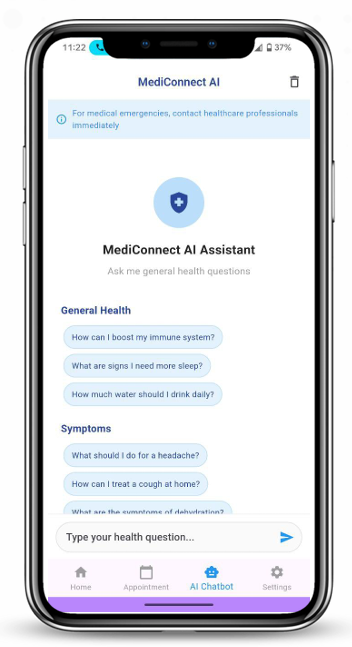

# MediConnect – Smart Clinic App with AI Chatbot 💬🏥

MediConnect is a telehealth mobile app built using Flutter and Firebase, featuring an AI chatbot that assists patients with clinic appointments, online consultation, and medical inquiries.

---

## 🚀 Key Features

### 🧑‍⚕️ 1. Smart AI Chatbot Assistant
- Provides instant responses to patient questions using **Meta AI (Llama AI)**.  
- Answers general health-related questions.  
- Provides medical FAQs (e.g., symptoms, prevention tips).  

### 📅 2. Appointment Booking System
- Patients can view available doctors and select appointment slots.  
- Doctors can manage and approve/reject appointments.  
- Real-time updates and confirmation through Firebase.  

### 📈 3. Online Consultation
- Patients can choose online consultation methods like **video calling** or **chatting**.  
- Patients and doctors can have secure communication through video or chat.  

### 📜 4. Patient Medical History
- Patients can view or edit their health records.  
- Doctors can review patient visit records for better diagnosis.  

### 🔔 5. Notification System
- Notifications are sent in real-time using **Firebase Cloud Messaging (FCM)**.  
- Patients and doctors receive reminders **30 minutes, 15 minutes, and 1 minute** before appointment time.  

### ⚙️ 6. Stripe Payment Gateway
- Patients can book appointments securely using their card via **Stripe Payment Gateway**.  

---

## 👥 User Roles

### 🧍 1) Patient
- Register and log in securely via **Firebase Authentication**.  
- Chat with the built-in AI assistant for health inquiries.  
- Book, view, and cancel online consultation appointments.  
- View and edit personal health reports.  
- Receive notifications for appointment reminders.  
- Choose medication **self-collection option**.  

### 🩺 2) Doctor
- Register and log in securely via **Firebase Authentication**.  
- View and manage patient appointment bookings.  
- Approve, reject, or reschedule appointments.  
- Join booked consultations (video or chat).  
- Access patient health history.  
- Update diagnosis or medical remarks after consultations.  

### 💁‍♀️ 3) Clinic Assistant
- Review registered doctor accounts for approval.  
- Scan **QR Code prescription** shown by patients.  
- Update prescription collection status.

## ⚙️ Tech Stack

- **Frontend:** Flutter (Dart)
- **Backend:** Firebase (Auth, Firestore, Storage, Cloud Messaging)
- **AI Integration:** Meta Llama AI API
- **Architecture:** MVC (Model View Controller)
- **Payment Gateway:** Stripe
- **Tools Used:** Visual Studio Code, Firebase Console, Jira Project Planning

## 📱 App Screenshots
|  |  |  |
|  |  |  |
|  |  |  |

